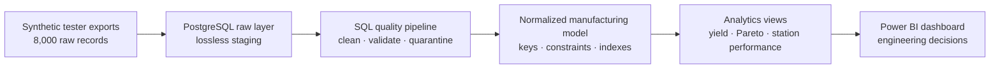
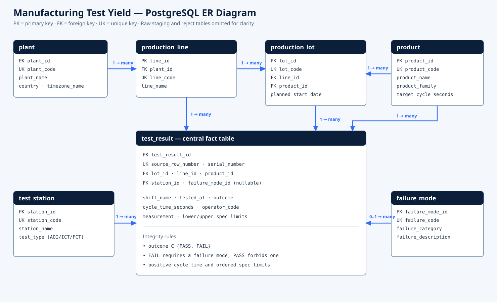

<div align="center">

# 🏭 Manufacturing Test Yield & Failure Analysis

### From noisy tester exports to production-ready engineering decisions

[](https://www.postgresql.org/)
[](https://learn.microsoft.com/en-us/power-bi/developer/projects/projects-overview)
[](database/04_advanced_analysis.sql)
[](python/generate_data.py)
[](data/raw_test_results.csv)
[](powerbi/)

An end-to-end manufacturing analytics portfolio project powered by PostgreSQL, advanced SQL, and Power BI. It turns deliberately messy production-test data into a normalized, validated model and an interactive failure-analysis dashboard.

[Dashboard](#dashboard-preview) · [Architecture](#database-architecture) · [SQL](#sql-implementation-map) · [Findings](#findings) · [Run locally](#run-locally)

</div>

## At a glance

| Production scale | Quality result | Strongest signal | Reporting contract |
|---|---:|---|---|
| 8,000 tests · 90 days · 120 lots | **94.48%** first-pass yield | `AOI-2` deteriorates to **90.65%** late-period yield | 4 reusable PostgreSQL analytics views |



## Engineering problem

Manufacturing engineers need to know whether first-pass yield is drifting, where defects concentrate, and whether slow test cycles signal equipment or process instability. Raw tester exports rarely arrive analysis-ready: text casing varies, outcome labels are inconsistent, timestamps and measurements arrive as strings, and dimensional attributes are repeated on every row.

This project implements a reproducible path from messy tester output to decision-ready reporting:

1. Python generates only the synthetic source data.
2. PostgreSQL stages raw text without losing source fidelity.
3. SQL standardizes, validates, deduplicates, joins, and quarantines bad rows.
4. Normalized production tables enforce referential and business integrity.
5. Analytics views expose a Power BI-ready reporting surface.
6. Advanced SQL detects ranking, changes, and trends with window functions.

## Dashboard preview

Power BI project: [`powerbi/Manufacturing Yield Dashboard.pbip`](powerbi/Manufacturing%20Yield%20Dashboard.pbip)

| Yield overview | Failure analysis |
|---|---|
|  |  |

The checked-in PBIR report definition passes the official authoring validator with **0 errors**. Both screenshots were captured from Power BI Desktop after importing all 8,000 PostgreSQL records. On a fresh machine, Power BI requires the one-time local PostgreSQL credential step described below before the visuals populate.

## ER diagram



The editable Mermaid source is in [`docs/er_diagram.mmd`](docs/er_diagram.mmd). The reporting fact is `manufacturing.test_result`; the surrounding dimensions describe plant/line, product/lot, station, and failure classification. `raw.test_result` and `raw.rejected_test_result` form the staging and quarantine layer and are intentionally omitted from the diagram for readability.

## Dataset

- **8,000** test-result records across 90 production days
- 2 plants, 4 production lines, 3 products, 6 test stations, 120 lots, and 6 failure modes
- Deliberately messy raw values: whitespace, mixed casing, and alternate `OK`/`NG` outcome labels
- Deterministic seed (`20260813`) for repeatable results
- Planted engineering signals: elevated `KUL-L2` failure risk, `AOI-2` late-period deterioration, and weaker `GW-C300` yield

The generator uses only the Python standard library and does not perform cleaning or analysis:

```powershell
python python/generate_data.py
```

## Database architecture

| Layer | Purpose | Key objects |
|---|---|---|
| `raw` | Lossless ingestion and rejects | `test_result`, `rejected_test_result` |
| `manufacturing` | Clean normalized operational model | `plant`, `production_line`, `product`, `production_lot`, `test_station`, `failure_mode`, `test_result` |
| `analytics` | Power BI and analysis contract | `v_test_detail`, `v_yield_daily`, `v_failure_pareto`, `v_station_performance` |

The design uses foreign keys, unique constraints, check constraints, a conditional failure-mode rule, and range validation. Five analytical indexes cover time, line/date, station/date, product/outcome, and the failure-mode subset; the lot table has a composite line/product index.

## Run locally

Prerequisites: Docker Desktop, Python 3.10+, and Power BI Desktop.

```powershell
# 1. Generate the deterministic CSV files
python python/generate_data.py

# 2. Start PostgreSQL 16 on localhost:5434
docker compose up -d

# 3. Create, load, clean, index, view, and validate the database
docker exec -i manufacturing-yield-postgres psql -U postgres -d postgres -f /project/database/run_all.sql
```

Expected validation result:

| Check | Expected |
|---|---:|
| Raw rows | 8,000 |
| Clean rows | 8,000 |
| Rejected rows | 0 |
| Orphaned foreign keys | 0 |
| Invalid outcome/failure-mode pairs | 0 |

### Power BI connection

Open [`powerbi/Manufacturing Yield Dashboard.pbip`](powerbi/Manufacturing%20Yield%20Dashboard.pbip), select **Refresh now**, and use:

| Setting | Value |
|---|---|
| Server | `localhost:5434` |
| Database | `manufacturing_yield` |
| Authentication | Database |
| User name | `postgres` |
| Password | `postgres` |

The semantic model imports `analytics.v_test_detail` through `PostgreSQL.Database(...)`. Microsoft documents PostgreSQL connectivity for both Import and DirectQuery; Import is used here so the report remains responsive while the database retains ownership of cleansing, joins, and reusable analysis views. See the [Microsoft PostgreSQL connector documentation](https://learn.microsoft.com/en-us/power-query/connectors/postgresql).

## SQL implementation map

| Requirement | Implementation |
|---|---|
| Database creation | [`database/00_create_database.sql`](database/00_create_database.sql) |
| Tables, keys, constraints | [`database/01_schema.sql`](database/01_schema.sql) |
| Cleaning CTEs, joins, quarantine | [`database/02_load_and_clean.sql`](database/02_load_and_clean.sql) |
| Views and indexes | [`database/03_indexes_and_views.sql`](database/03_indexes_and_views.sql) |
| `JOIN`, `GROUP BY`, subquery, CTE | Queries 1–3 in [`database/04_advanced_analysis.sql`](database/04_advanced_analysis.sql) |
| `RANK()`, `LAG()`, rolling average | Queries 3–7 in [`database/04_advanced_analysis.sql`](database/04_advanced_analysis.sql) |
| Validation tests | [`database/05_validation.sql`](database/05_validation.sql) |

Window functions are appropriate here because they retain the individual daily/station rows while adding comparative context such as previous-day yield, rank, cumulative Pareto share, and a seven-day rolling average. See the [PostgreSQL window-function tutorial](https://www.postgresql.org/docs/current/tutorial-window.html).

## Findings

The validated synthetic production run produced these reproducible results:

- Overall first-pass yield is **94.48%**: 7,558 passes and 442 failures from 8,000 tests.
- `KUL-L2` is the weakest line at **92.57%** yield versus **95.55%** for `KUL-L1`, a 2.98-point gap worth investigating by product, station, and shift.
- `AOI-2` is the weakest station at **93.50%** yield. Its yield falls from **95.26% before day 55** to **90.65% from day 55 onward**, a clear deterioration signal surfaced by the `LAG()` and rolling-average queries.
- `GW-C300` is the weakest product at **93.90%** yield; the other two products remain above 94.7%.
- Solder bridges lead the Pareto with **111 failures (25.11%)**. Solder bridges plus open circuits account for **46.38%** of all failures, while the top four modes account for **78.73%**.
- Night shift is the weakest shift at **94.12%** yield, although the line/station mix should be controlled before attributing causation to staffing.
- Only **48.80%** of tests meet their product cycle-time target. Because average cycle time is 46.23 seconds but target attainment is below half, the next engineering step is to examine target calibration and the upper tail by station (`p95_cycle_seconds`).

These are synthetic findings, not claims about a real factory. The planted effects make the analysis and visuals testable without using confidential production data.

## Power BI pages

**Yield Overview**

- KPI row: total tests, first-pass yield, failed units, average cycle time
- Daily yield trend
- Yield by production line
- Failed tests by station
- Defect rate and cycle-target attainment by shift
- Product slicer

**Failure Analysis**

- Failure KPIs
- Failure-mode Pareto
- Failure category comparison
- Line/station/failure hotspot table
- Plant slicer

## Project structure

```text
manufacturing-yield-dashboard/
├── data/                  # 8,000-row raw CSV plus dimension CSVs
├── database/              # creation, schema, cleaning, views, queries, validation
├── docs/
│   ├── er_diagram.mmd
│   ├── er_diagram.svg
│   └── screenshots/
├── powerbi/               # PBIP, PBIR report, and TMDL semantic model
├── python/generate_data.py
├── docker-compose.yml
└── README.md
```

## Reproducibility and reset

The SQL load is designed to be rerunnable. To discard the Docker database volume and rebuild from the CSVs:

```powershell
docker compose down -v
docker compose up -d
docker exec -i manufacturing-yield-postgres psql -U postgres -d postgres -f /project/database/run_all.sql
```

Power BI source parameters are defined in TMDL at [`powerbi/Manufacturing Yield Dashboard.SemanticModel/definition/expressions.tmdl`](powerbi/Manufacturing%20Yield%20Dashboard.SemanticModel/definition/expressions.tmdl), so a different server or database can be configured without rewriting the report visuals.

## References

- [Microsoft Power Query PostgreSQL connector](https://learn.microsoft.com/en-us/power-query/connectors/postgresql)
- [PostgreSQL: Window Functions](https://www.postgresql.org/docs/current/tutorial-window.html)
- [Microsoft Power BI Desktop projects (PBIP)](https://learn.microsoft.com/en-us/power-bi/developer/projects/projects-overview)
- [Microsoft PBIR report folder](https://learn.microsoft.com/en-us/power-bi/developer/projects/projects-report)
